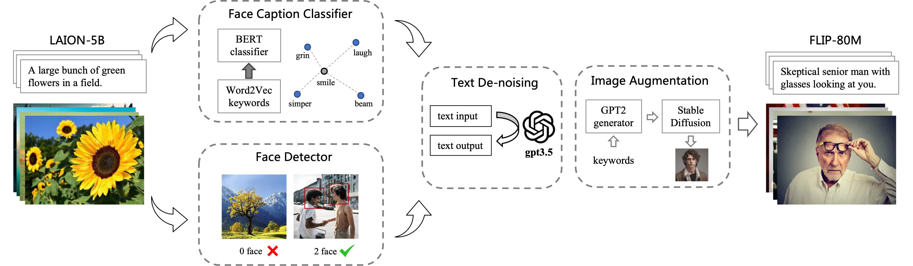

# FLIP-80M: A Large-Scale Facial Language-Image Dataset

**ACM MM 2024 (Oral)**

**FLIP-80M: 80 Million Visual-Linguistic Pairs for Facial Language-Image Pre-Training**  
*Yudong Li, Xianxu Hou, Dezhi Zheng, Linlin Shen, and Zhe Zhao*

[Paper](https://openreview.net/pdf?id=FHguB1EYYi)  | [BibTex](#citation)  

**tl; dr** We release an 80-million face-text dataset and different CLIP-like models pre-trained on our dataset.




## Models

We fine-tune the CLIP model using the proposed FLIP-80M to create FLIP (Facial Language-Image Pretraining).

## Usage

The dataset and models are publicly available and can be accessed through the following links:

- Dataset: [FLIP-80M on Hugging Face](https://huggingface.co/datasets/FLIP-dataset/FLIP-80M)
- Models
  - [FLIP-ViT-B/32](https://huggingface.co/FLIP-dataset/FLIP-base-32)
  - [FLIP-ViT-B/16](https://huggingface.co/FLIP-dataset/FLIP-base-16)
  - [FLIP-ViT-L/14](https://huggingface.co/FLIP-dataset/FLIP-large-14)

How to use:
```
from PIL import Image
import requests

from transformers import CLIPProcessor, CLIPModel

model = CLIPModel.from_pretrained("P01son/FaceCLIP-base-32")
processor = CLIPProcessor.from_pretrained("P01son/FaceCLIP-base-32")

url = "http://images.cocodataset.org/val2017/000000039769.jpg"
image = Image.open(requests.get(url, stream=True).raw)

inputs = processor(text=["a photo of a cat", "a photo of a dog"], images=image, return_tensors="pt", padding=True)

outputs = model(**inputs)
logits_per_image = outputs.logits_per_image # this is the image-text similarity score
probs = logits_per_image.softmax(dim=1) # we can take the softmax to get the label probabilities

```

## Training Details

The models are pre-trained with [TencentPretrain](https://github.com/Tencent/TencentPretrain) framework on 8 * A100 GPUs:
```
python3 pretrain.py --dataset_path faceclip.pt \
	--pretrained_model_path models/clip-b32.bin \
	--output_model_path models/faceclip-b32.bin \
	--config_path models/clip/base-32_config.json \
	--vocab_path vocab.json --merges_path merges.txt --tokenizer clip \
	--world_size 8 --gpu_ranks 0 1 2 3 4 5 6 7 --data_processor clip --accumulation_steps 8 --learning_rate 2e-5 \
	--total_steps 200000 --save_checkpoint_steps 20000 --batch_size 160 --report_steps 500
```


## Citation

If you use the FLIP-80M dataset or models in your research, please cite the following paper:

```
@inproceedings{li2024flip,
  title={FLIP-80M: 80 Million Visual-Linguistic Pairs for Facial Language-Image Pre-Training},
  author={Li, Yudong and Hou, Xianxu and Dezhi, Zheng and Shen, Linlin and Zhao, Zhe},
  booktitle={Proceedings of the 32nd ACM International Conference on Multimedia},
  pages={58--67},
  year={2024}
}
```


## License


Licensed under the Apache License, Version 2.0 (the "License");
you may not use this file except in compliance with the License.
You may obtain a copy of the License at

    http://www.apache.org/licenses/LICENSE-2.0

Unless required by applicable law or agreed to in writing, software
distributed under the License is distributed on an "AS IS" BASIS,
WITHOUT WARRANTIES OR CONDITIONS OF ANY KIND, either express or implied.
See the License for the specific language governing permissions and
limitations under the License.


